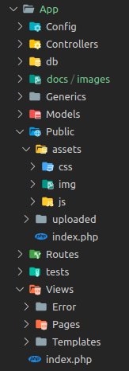

# ScoobyPHP

> Mais um framework MVC feito com amor e PHP.

O desenvolvimento de aplicações web tem se tornado cada vez mais necessário no cenário atual, seguindo esta tendência, a padronização de escrita de código, estruturação de projeto e etc tem evoluído cada dia mais, não é difícil nos depararmos com novos padrões adotados pela comunidade. Levando em consideração toda essa evolução e necessidade, proporcionamos aos desenvolvedores, principalmente aqueles que estão tendo um primeiro contato com um framework
php
, uma maior facilidade e conforto na estruturação dos diretórios, agilidade e desempenho nas entregas, segurança e organização do projeto.

## Instalação

### OS X & Linux

O modo mais fácil de instalar o ScoobyPHP é clonar o repositório do instalador no github, ou baixar o instalador no site oficial.
Lembrando que será necessário ter o composer e o npm instalado no computador em questão.

Clonando o instalador:

```sh
git clone https://github.com/terriani/ScoobyNewProject.git
```

Baixando o instalador pelo site oficial:

vá ate o site oficial que se encontra em ScoobyPHP.tech/install, baixe o instalador, descompacte no diretório onde será criado o projeto, htdocs/ ou www/ por exemplo e pronto isso será o bastante para iniciarmos com o ScoobyPHP.

Após clonar o repositório ScoobyNewProject acesse ele e copie o arquivo que encontra-se em seu interior, caso tenha efetuado o download no site o arquivo estará pronto para o uso, não sendo necessário entrar na pasta e copiar o mesmo.

para rodarmos o instalador do ScoobyPHP basta e entrar na pasta onde o arquivo scooby-create-app se encontra e executar o comando:

```sh
php scooby-create-app
```

Ao executar este comando, será solicitado no terminal que o programador de um nome para o novo projeto, informe este nome e aguarde o termino da instalação. Pode ser que o instalador necessite da senha do usuário logado para a manipulação do cache e para dar as devidas permissões no projeto, caso isso aconteça, informe a senha requerida e aguarde o fim da instalação.

Quando a instalação chegar ao final uma mensagem de informando o sucesso desta operação sera apresentada, note que também será criado um repositório com o nome que foi informado no começo da instalação. Este diretório contem tudo que será necessário para o desenvolvimento da sua nova aplicação web.

### Windows

Primeiramente será necessário fazer o download do git bash no site: git-scm.com

Após o download e instalação do git bash siga o guia de instalação para LINUX e OS X

### Clonando o ScoobyPHP direto do github

Também é possível clonar o repositório do ScoobyPHP direto do github, para isso basta entrar no terminal, ou caso esteja usando windows, será necessário utilizar o git bash e navegar ate a pasta onde ficam os projetos, por exemplo, htdocs/ ou www/, execute o comando:

```sh
git clone https://github.com/terriani/ScoobyPHP.git
```

Após clonar o projeto será necessário instalar as suas dependências, para isto basta rodar dois comandos no terminal na na pasta raiz do projeto. Primeiro instale as dependências do composer, para isto execute:

```sh
composer install
```

Após o termino da instalação das dependências do composer, vamos instalar as dependências do javascript:

```sh
npm install
```

Pronto agora com as dependências instaladas, já é possível renomear a pasta do ScoobyPHP para o nome do seu projeto, Lembrando que será necessário entrar na pasta que do projeto, lá dentro entre em: App/Config/config.php e altere o nome do seu projeto na constante SITE_NAME, trocando o scoobyPHP para o nome que do projeto. Caso a instalação tenha sido feito com o instalador não será necessário fazer nenhuma alteração nas configurações do framework.

## Executando o projeto no navegador

Levando em consideração que todos os passos anteriores foram executados corretamente e seu servidor local, por exemplo o xampp, esteja rodando sem error,abra seu navegador e digite na barra de endereço:

```sh
http://localhost/NomeDoProjeto/
```

Caso a instalação tenha dado tudo cero, uma tela de boas vindas será apresentada.


## Estrutura de pastas

A pasta App será onde toda a regra de negócio ficará, esta pasta contém os controllers, models, rotas, arquivos de configuração, seeds, migrations, a pasta public onde ficaram os arquivos css, javascript, imagens utilizadas na aplicação,imagens vindas de uploads, views e uma pasta nomeada de Grenerics, que será explicada sua função no decorrer deste guia.

Estrutura de pasta App/:



### Breve descrição de cada pasta dentro do diretório App/

#### App/

Pasta onde será criada toda a regra de negócios da aplicação, em todo o ciclo de vida do web app só será necessário ter conhecimento desta pasta em questão.

#### App/Config

Esta pasta conterá todas as configurações da aplicação, como por exemplo, configurações de banco de dados, envio de e-mail e etc...

#### App/Config/lang

Nesta pasta ficam os arquivos de tradução do systema, caso deseje fazer um sistema multilinguagem será abordado mais a diante deste guia como implementar esta funcionalidade.

#### App/Controllers

Aqui ficam todos os controlers da aplicação, esta pasta não aceita outras pastas dentro dela, ou seja, o ScoobyPHP até a versão atual não aceita pastas especificas para a criação de controllers específicos, por exemplo: App/Controllers/Auth/UserController, essa arquitetura de organização dos controllers separados em pastas irá gerar um erro na aplicação.

#### App/db

Nesta pasta ficam os arquivos de migrations e seeds

#### App/db/migration

Dentro desta pasta ficaram todas as migrations geradas pelo sistema.

#### App/db/seeds

Dentro desta pasta ficaram todas as seeds geradas pelo sistema, ao decorrer deste guia sera abordado como gerar migrations, seeds e muito mais utilizando o scooby-do, uma ferramenta de linha de comando.

#### App/Extensions

Nesta pasta pode ser usada para um propósito geral, para a criação de metodos auxiliares, extensão dos helpers, validações, etc...

#### App/Models

Aqui ficaram todo os models da aplicação, ao decorrer deste guia sera abordado como gerar models via terminal utilizando o scooby-do.

#### App/Public

Nesta pasta ficaram os arquivos públicos da aplicação.

#### App/Public/assats/css

Neste local ficará todos os arquivos css da aplicação, não deverá ser criadas pastas aqui dentro, pois o ScoobyPHP mapeia esta pasta para minificar os arquivos e inclui-los no template.

#### App/Public/assets/img

Aqui ficaram as imagem utilizadas pela aplicação

#### App/Public/assats/js

Neste local ficará todos os arquivos javascript da aplicação, não deverá ser criadas pastas aqui dentro, pois o ScoobyPHP mapeia esta pasta para minificar os arquivos e incluí-los no template.

#### App/Public/uploaded

Nesta pasta ficará todos os arquivos upados da aplicação

#### App/Routes

Nesta pasta ficaram todos os arquivos de rotas, caso necessário poderá ser criado mais de um arquivo contendo diferentes rotas do sistema.

#### App/tests

Aqui ficará todos os testes da aplicação [Ainda não está em funcionamento]

#### App/Views

Aqui ficam as paginas da aplicação, templates e paginas de erro

#### App/Views/Error

Nesta pasta ficam as páginas de erro do sistema, como por exemplo a página de erro 404.

#### App/Views/pages

Aqui ficam todas as páginas da aplicação, sendo assim o diretório responsável pelo frontend do app.

#### App/Views/templates

Nesta página ficam todos os arquivos de template frontend da aplicação.

## Os componentes do MVC

Tradicionalmente usado para interfaces gráficas de usuário (GUIs), esta arquitetura tornou-se popular para projetar aplicações web e até mesmo para aplicações móveis, para desktop e para outros clientes. Linguagens de programação populares como Java, C#, Ruby, PHP e outras possuem frameworks MVC populares que são atualmente usados no desenvolvimentos de aplicações web.

### Camada de modelo ou da lógica da aplicação (Model)

Modelo é a ponte entre as camadas Visão (View) e Controle (Controller), consiste na parte lógica da aplicação, que gerencia o comportamento dos dados através de regras de negócios, lógica e funções. Esta fica apenas esperando a chamada das funções, que permite o acesso para os dados serem coletados, gravados e, exibidos.

É o coração da execução, responsável por tudo que a aplicação vai fazer a partir dos comandos da camada de controle em um ou mais elementos de dados, respondendo a perguntas sobre o sua condição e a instruções para mudá-las. O modelo sabe o que o aplicativo quer fazer e é a principal estrutura computacional da arquitetura, pois é ele quem modela o problema que está se tentando resolver. Modela os dados e o comportamento por trás do processo de negócios. Se preocupa apenas com o armazenamento, manipulação e geração de dados. É um encapsulamento de dados e de comportamento independente da apresentação.

### Camada de apresentação ou visualização (View)

Visão pode ser qualquer saída de representação dos dados, como uma tabela ou um diagrama. É onde os dados solicitados do Modelo (Model) são exibidos. É possível ter várias visões do mesmo dado, como um gráfico de barras para gerenciamento e uma visão tabular para contadores. A Visão também provoca interações com o usuário, que interage com o Controle (Controller). O exemplo básico disso é um botão gerado por uma Visão, no qual um usuário clica e aciona uma ação no Controle.

Não se dedica em saber como o conhecimento foi retirado ou de onde ela foi obtida, apenas mostra a referência. Segundo Gamma et al (2006), ”A abordagem MVC separa a View e Model por meio de um protocolo inserção/notificação (subscribe/notify). Uma View deve garantir que sua expressão reflita o estado do Model. Sempre que os dados do Model mudam, o Model altera as Views que dependem dele. Em resposta, cada View tem a oportunidade de modificar-se”. Adiciona os elementos de exibição ao usuário : HTML, ASP, XML, Applets. É a camada de interface com o usuário. É utilizada para receber a entrada de dados e apresentar visualmente o resultado.

### Camada de controle ou controlador (Controller)

Controle é o componente final da tríade, faz a mediação da entrada e saída, comandando a visão e o modelo para serem alterados de forma apropriada conforme o usuário solicitou através do mouse e teclado. O foco do Controle é a ação do usuário, onde são manipulados os dados que o usuário insere ou atualiza, chamando em seguida o Modelo.

O Controle (Controller) envia essas ações para o Modelo (Model) e para a janela de visualização (View) onde serão realizadas as operações necessárias.

## Desvendadndo os Controllers

Ao se trabalhar com o padrão MVC grande parte do projeto será desenvolvido nos controllers, neste tópico iremos criar nosso primeiro controller, descobrir como chamar uma view, como instanciar um model, como utilizar os helpers do ScoobyPHP, como user o método dd() do laravel, para debugar a aplicação e muito mais...

### Criando um controller

para criarmos um controller, basta irmos ate a pasta Controllers, que se encontra em App/Controllers/, lá criaremos um novo arquivo com o nome desejado, com a primeira letra maiúscula e acompanhado da palavra Controller e finalizando com .php, ficando deste jeito por exemplo: HomeController.php.

Ao abrir o Controller recém criado basta adicionar o código abaixo:

```php
<?php

namespace Scooby\Controllers;

use Scooby\Core\Controller;

class HomeController extends Controller
{
    /**
    * @return void
    */
    public function index(): void
    {
        //
    }
}
```

Pronto, com algumas linhas de código já temos um controller criado e pronto para o uso. Uma rotina muito comum de se fazer nos controllers é o ato de chamar uma view, seja ela um formulário, uma tela de login ou qualquer outra tela existente na aplicação e para exibirmos uma view no navegador do usuário é muito simples, por estarmos estendendo o controller base do Scooby, temos acesso aos seus métodos e um deles é o metodo view, que é responsável por exibir uma view para o usuário final do app.

Para chamar uma view no navegador do usuário, levando em consideração que a view já foi previamente criada na pasta App/Views/Pages/, basta escrever o seguinte código dentro do método desejado. Exemplo de um controller chamando uma view na action index.

```php
<?php

namespace Scooby\Controllers;

use Scooby\Core\Controller;

class HomeController extends Controller
{
    /**
    * Metodo index esta chamando uma view na pasta Pages com o nome Home.twig
    *
    * @return void
    */
    public function index(): void
    {
        $this->view('pages', 'Home', []);
    }
}
```

Note que o método view mapeia a chamada para dentro da pasta App/Views, sendo necessário somente informar a pasta em que você deseja chamar o arquivo de visualização. Note também que o método view recebe como terceiro parâmetro um array, que no caso do exemplo está vazio, porém neste array mandamos informações para a view, podendo ser strings, retornos de métodos, ou qualquer coisa que desejarmos.

Exemplo de envio de um texto de boa vindas do metodo index para a view home.

```php
<?php

namespace Scooby\Controllers;

use Scooby\Core\Controller;

class HomeController extends Controller
{
    /**
    * Envio de msg de boas vindas para a view home.twig que se encontra em: App/* Views/pages/
    *
    * @return void
    */
    public function index(): void
    {
        $this->view('pages', 'Home', [
            'wellcomeMessage' => 'Sejam Bem Vindos ao SccobyPHP!!!'
        ]);
    }
}
```

Para passarmos o valor para a view usamos um array associativo, onde a chave do array, que no nosso exemplo é ' wellcomeMessage ', será a variável que acessaremos na view, neste momento não precisa se preocupar e caso não tenha entendido como será feita esta tarefa, quando entrarmos no estudo de views todas as dúvidas serão sanadas.

### [***ATENÇÃO*** - ESCRITA DA DOCUMETAÇÃO EM ANDAMENTO...]

## Histórico de lançamentos

* 1.0
LANÇAMENTO: Lançamento da versão 1.0

## Autor

* **Vinicius Terriani** – [@vinicius_terriani](https://twitter.com/VTerriani) – viniciusterriani.esy.es

Distribuído sob a licença MIT. Veja [LICENSE](LICENSE) para mais informações.

[https://github.com/terriani/ScoobyPHP](https://github.com/terriani/)

## Contributing

1. Faça o _fork_ do projeto (<https://github.com/terriani/ScoobyPHP/fork>)
2. Crie uma _branch_ para sua modificação (`git checkout -b feature/fooBar`)
3. Faça o _commit_ (`git commit -am 'Add some fooBar'`)
4. _Push_ (`git push origin feature/fooBar`)
5. Crie um novo _Pull Request_
